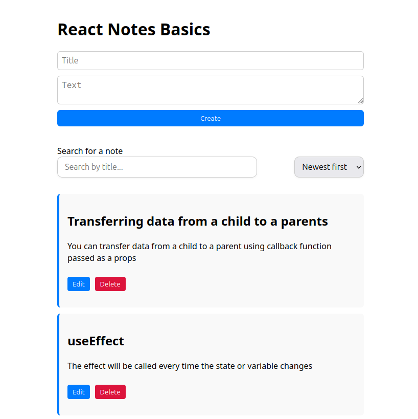

# 📝 React Notes Basics

This project is a simple **Notes Manager** application built with **React**.  
It was created as a hands-on way to learn and practice the **fundamentals of React** through real implementation.

## 🚀 Project Goal

The goal of this project is to **master the core concepts of React** by building a working application from scratch.  
It focuses on writing clean and understandable React code without relying on external UI libraries or advanced tools.

---

## 🧠 Features Covered (React Fundamentals)

This app was built step-by-step while learning the following React features:

- ✅ Functional components and JSX
- ✅ Props and state management
- ✅ Event handling
- ✅ Controlled components and forms
- ✅ Conditional rendering
- ✅ Lists rendering and unique keys
- ✅ `useState` and `useEffect` hooks
- ✅ `useRef` for direct DOM access
- ✅ Lifting state up and component communication
- ✅ Creating and deleting notes
- ✅ Editing notes using a modal component
- ✅ Search and sort functionality
- ✅ Saving and loading notes using `localStorage`
- ✅ Basic layout and styling (without CSS frameworks)

---